# Projektdokumentation – What2Watch

## Inhaltsverzeichnis

1. [Ausgangslage](#1-ausgangslage)
2. [Lösungsidee](#2-lösungsidee)
3. [Vorgehen & Artefakte](#3-vorgehen--artefakte)
    1. [Understand & Define](#31-understand--define)
    2. [Sketch](#32-sketch)
    3. [Decide](#33-decide)
    4. [Prototype](#34-prototype)
    5. [Validate](#35-validate)
4. [Erweiterungen](#4-erweiterungen)
5. [Projektorganisation](#5-projektorganisation)
6. [KI-Deklaration](#6-ki-deklaration)
7. [Anhang](#7-anhang)

> **Hinweis:** Massgeblich sind die im **Unterricht** und auf **Moodle** kommunizierten Anforderungen.

<!-- WICHTIG: DIE KAPITELSTRUKTUR DARF NICHT VERÄNDERT WERDEN! -->

---

## 1. Ausgangslage

- **Problem:** Wer regelmässig Filme und Serien schaut, verbringt oft mehr Zeit mit der Suche nach dem richtigen Inhalt als mit dem Schauen selbst. Streaming-Plattformen bieten zwar riesige Kataloge, aber kein einfaches Werkzeug, um schnell zu entscheiden, neue Inhalte spielerisch zu entdecken und den persönlichen Überblick (gesehen / geplant / gemocht) zu behalten. Das Ergebnis ist Entscheidungslähmung («Decision Fatigue»).
- **Ziele:**
  - Web-App entwickeln, die das Entdecken von Filmen/Serien durch ein Swipe-Prinzip vereinfacht
  - Interessante Inhalte als Favoriten speichern und in eine persönliche Watchlist aufnehmen
  - Übersicht über gesehene und noch zu schauende Inhalte verwalten
  - Datenpersistenz: Nutzerdaten bleiben nach dem Ausloggen erhalten
  - Realistischer Filmkatalog mit echten Posterdaten
- **Primäre Zielgruppe:** Filmbegeisterte Privatpersonen im Alter von 18–35 Jahren, die 2–3 Streaming-Plattformen nutzen und sich häufig nicht entscheiden können, was sie als Nächstes schauen möchten.
- **Weitere Stakeholder:** Keine weiteren institutionellen Stakeholder; Einzelprojekt im Modul Data Management.

---

## 2. Lösungsidee

- **Kernfunktionalität:**
  1. **Swipe-Modus:** Film/Serie wird einzeln mit Poster, Titel und Beschreibung angezeigt. Swipe rechts (🔥) = Favorit, Swipe links = verworfen.
  2. **Favoriten-Liste:** Alle gemochten Inhalte, filterbar nach Typ (Film/Serie) und Genre.
  3. **Watchlist:** Geplante Inhalte; «Gesehen ✔» verschiebt den Eintrag in den Watched-Bereich.
  4. **Detailansicht:** Klick auf ein Poster öffnet Detailseite mit Backdrop, Beschreibung, Genre und Jahr.
  5. **Profil & Account:** Registrierung, Login, Avatar-Upload, persönliche Statistiken.
- **Annahmen:** Das Swipe-Prinzip ist aus anderen Apps (Tinder, Instagram Reels) bekannt und intuitiv. Nutzer erwarten, dass ihre Daten nach dem Ausloggen erhalten bleiben.
- **Abgrenzung:** Keine eigene Empfehlungs-Engine (kein ML/Algorithmus). Kein direktes Streaming oder Verlinkung zu Plattformen. Kein Echtzeit-Multiplayer-Sync.

---

## 3. Vorgehen & Artefakte

### 3.1 Understand & Define

- **Zielgruppenverständnis:**

  Die Problemanalyse basierte auf eigener Erfahrung als Teil der Zielgruppe sowie informellen Gesprächen im Freundeskreis. Als Proto-Persona wurde folgendes Profil definiert:

  > **Proto-Persona – «Der unentschlossene Filmfan»**
  > Alter: 20–28 Jahre, Student oder Berufseinsteiger. Nutzt 2–3 Streaming-Plattformen. Schaut 3–5× pro Woche Filme/Serien. Kennt Swipe-Mechanismen aus Tinder/TikTok. Möchte Inhalte merken, ohne sie sofort schauen zu müssen.

- **Wesentliche Erkenntnisse:**
  - Hauptproblem ist Entscheidungslähmung – zu viele Optionen, zu wenig Struktur
  - Eine spielerische, schnelle Interaktion (Swipe) senkt die Hemmschwelle zur Entscheidung
  - Nutzer wollen «gefällt mir» und «werde ich schauen» klar trennen können
  - Persistenz ist entscheidend: gespeicherte Inhalte müssen nach dem Ausloggen vorhanden bleiben

---

### 3.2 Sketch

- **Variantenüberblick:**

  | Variante | Beschreibung | Vorteil | Nachteil |
  |---|---|---|---|
  | **A – Swipe-First** *(gewählt)* | Entdeckung durch Swipe als Haupteinstieg | Spielerisch, schnell, intuitiv | Nutzer muss durch Inhalte swipen |
  | **B – Suche-First** | Suchfeld als Haupteinstieg | Direkt bei bekannten Titeln | Kein Entdeckungscharakter |

- **Skizzen:**

  Die ersten Handskizzen entstanden am **15.04.2026** und zeigen alle geplanten Screens:

  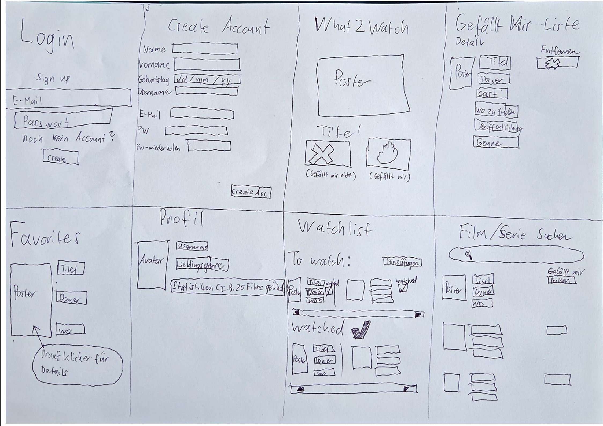
  *(Handgezeichnete Skizze: Login, Create Account, Swipe-Screen, Gefällt-Mir-Liste, Favoriten, Profil, Watchlist, Film/Serie Suchen)*

  Skizzierte Screens und Unterschiede zur finalen App:
  - **Login / Create Account:** E-Mail + Passwort + Username – unverändert übernommen
  - **Swipe-Screen:** Grosses Poster, Accept/Decline – umgesetzt, visuell stark weiterentwickelt
  - **Favoriten:** Liste mit Poster und Titel – umgesetzt, um Genre-Filter erweitert
  - **Profil:** Avatar, Statistiken – umgesetzt, um Avatar-Upload (10 MB) erweitert
  - **Watchlist:** To Watch + Watched – umgesetzt inkl. sitzungsübergreifender Persistenz

  **Peer Feedback zur Skizze – Arthik Muralitharan (15.04.2026):**
  > «Es sieht alles übersichtlich aus und ist für den User einfach gehalten, mit nicht zu vielen Knöpfen. Einzig verwirrend finde ich den Unterschied zwischen 'Favorit' und 'Gefällt mir'. Ansonsten alles super.»

  Massnahme: Terminologie vereinheitlicht → «Favoriten» für gemochte Inhalte, «Watchlist» für geplante.

---

### 3.3 Decide

- **Gewählte Variante & Begründung:** Variante A (Swipe-First) wurde gewählt, da sie das Kernproblem (Entscheidungslähmung) direkter adressiert und einen Entdeckungscharakter schafft. Eine Suchfunktion wurde ergänzend als «Film manuell hinzufügen» realisiert.

  Weitere Entscheidungen:

  | Entscheidung | Gewählt | Verworfen | Begründung |
  |---|---|---|---|
  | Datenspeicherung | MongoDB (serverseitig) | Nur localStorage | Persistenz über Geräte/Sessions |
  | Authentifizierung | Eigenes Session-System | OAuth/Social Login | Einfacher, kein Drittanbieter |
  | Theme | Dark (#09090b) mit Farbakzenten | Light Theme | Cinematisches Feeling |
  | Navigation | Bottom Nav (Mobile) + Top Nav (Desktop) | Nur Sidebar | Native App-Feel auf Smartphones |

- **End-to-End-Ablauf** (User Journey / Activity Diagram):

  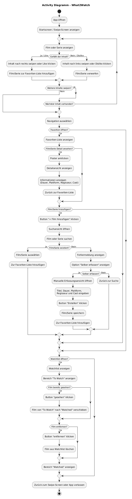
  *(Activity Diagramm: App öffnen → Swipe → Favoriten → Watchlist → Watched, inkl. Film hinzufügen und alle Navigationspfade)*

  Hauptflow: App öffnen → Swipe-Screen → rechts swipen → Favoriten-Liste → «To Watch» → Watchlist → «Gesehen ✔» → Watched

- **Mockup:** Klickbarer Figma-Prototyp, erstellt am **27.04.2026**

  > Figma-Prototyp: [What2Watch Figma Link hier einfügen]

  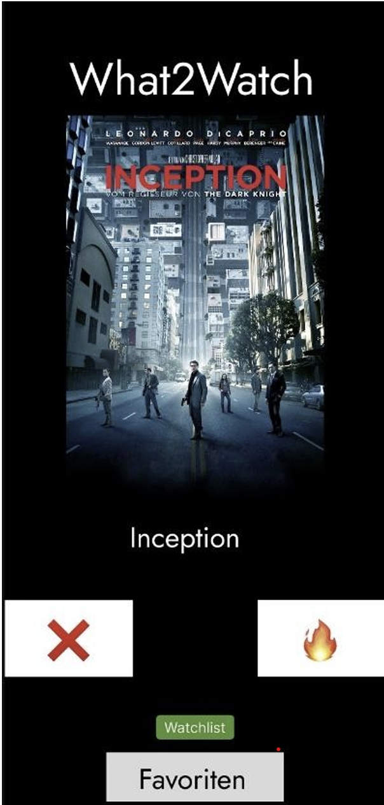
  *(Figma: Swipe-Modus mit Inception-Poster, X- und Feuer-Button)*

  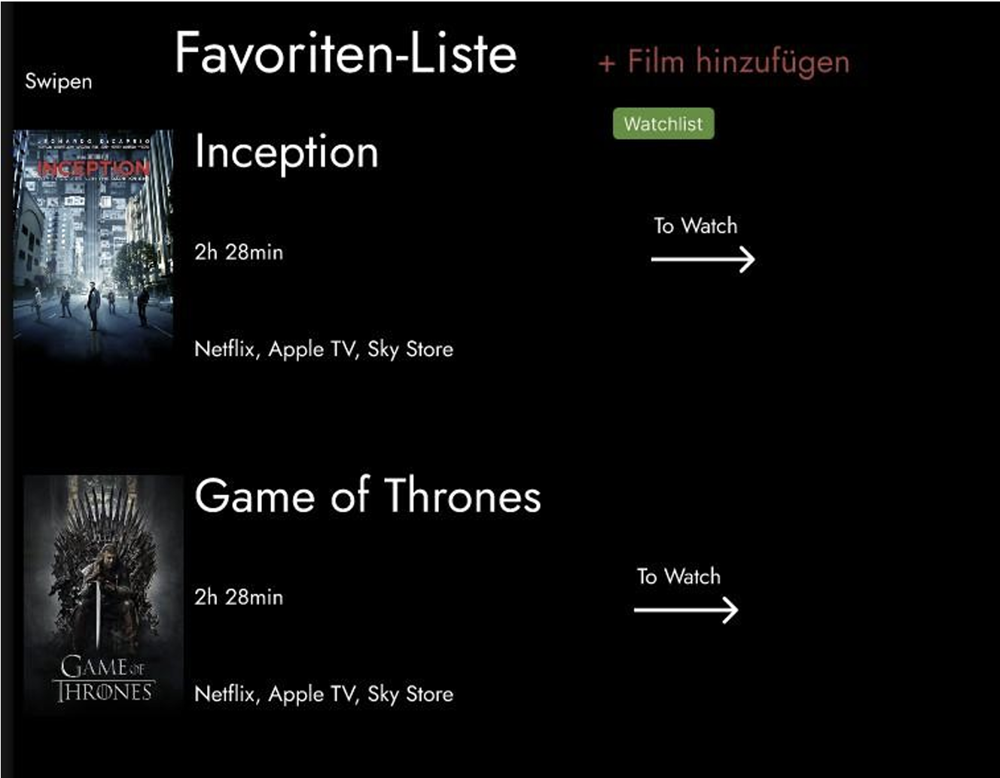
  *(Figma: Favoriten-Liste mit Inception und Game of Thrones, «To Watch»-Pfeil)*

  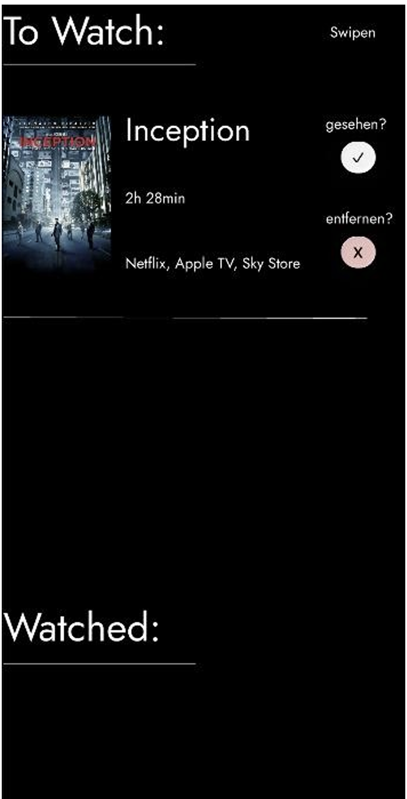
  *(Figma: Watchlist mit To-Watch-Bereich und Watched-Sektion)*

  Das Figma-Mockup diente als gestalterische Grundlage. Kernflows und Informationsarchitektur wurden übernommen; das visuelle Design wurde in der Implementierungsphase stark weiterentwickelt.

---

### 3.4 Prototype

#### 3.4.1 Entwurf (Design)

- **Informationsarchitektur:**

  | Route | Beschreibung |
  |---|---|
  | `/` | Startseite mit animiertem Hintergrund, Stats und CTAs |
  | `/swipe` | Swipe-Modus (Kernfunktion) |
  | `/favorites` | Favoriten-Liste mit Typ- und Genre-Filter |
  | `/watchlist` | Watchlist + Watched-Bereich |
  | `/movie/[id]` | Detailansicht Film/Serie |
  | `/add` | Film/Serie zur Datenbank hinzufügen |
  | `/profile` | Benutzerprofil mit Avatar und Statistiken |
  | `/friends` | Freunde suchen und Anfragen verwalten |
  | `/friends/[userId]` | Freundesprofil mit gemeinsamen Favoriten |
  | `/login` / `/register` | Authentifizierung |

- **User Interface Design:**

  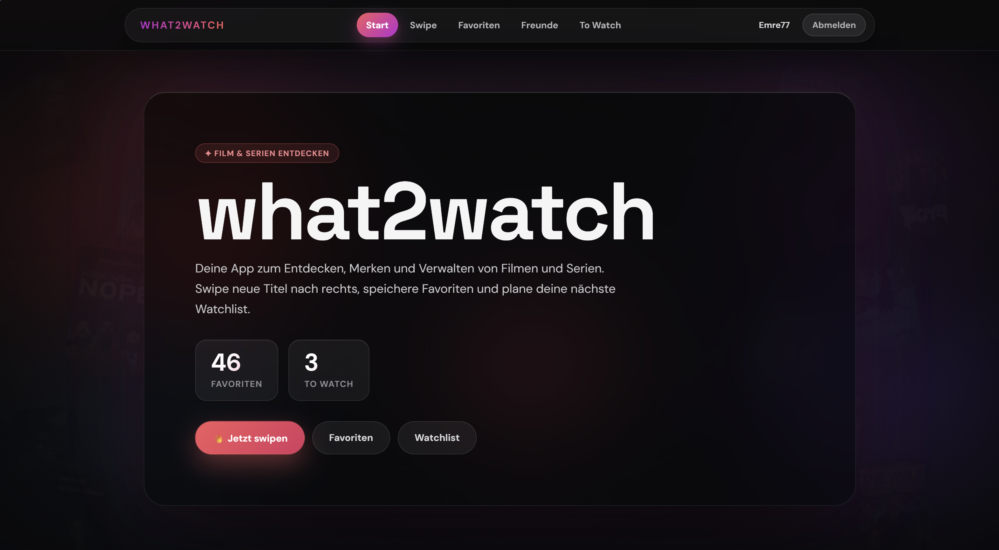
  *(Startseite: 5 animierte Gradient-Orbs, schwebende Filmposterkarten im Hintergrund, Glassmorphism-Hero-Card, Stats-Kacheln und Action-Buttons)*

  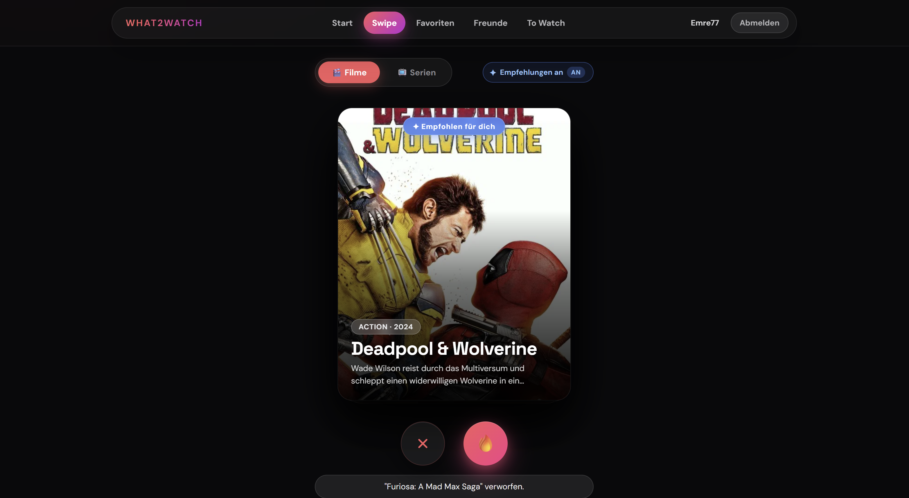
  *(Swipe-Screen: Filmposterkarte mit Titel, Genre, Jahr, Beschreibung; Decline links, Accept rechts mit Gradient-Glow)*

  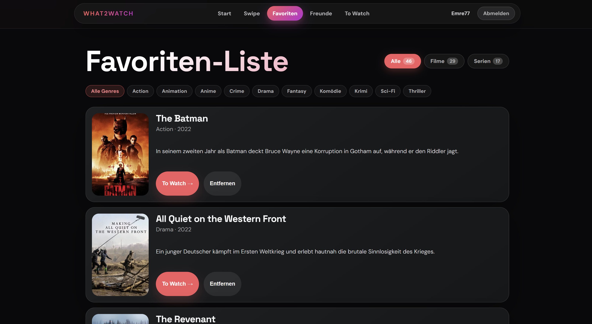
  *(Favoriten-Liste: Filter-Tabs Alle/Filme/Serien, Genre-Chips, Filmkarten mit «To Watch»-Button)*

  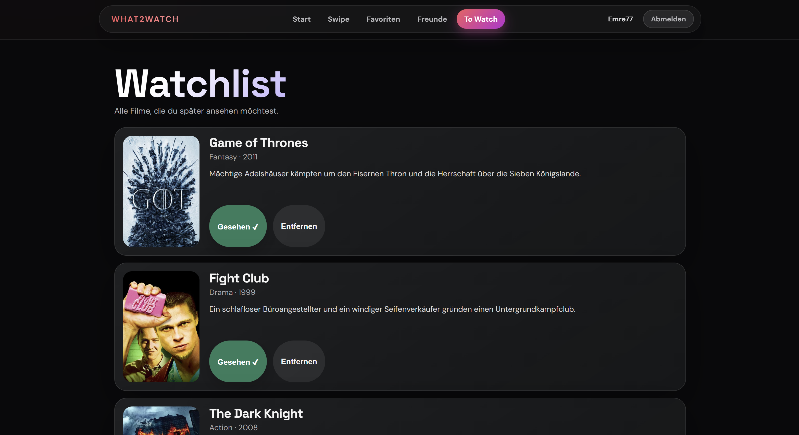
  *(Watchlist: To-Watch-Bereich mit «Gesehen ✔»-Button; darunter Watched-Sektion)*

  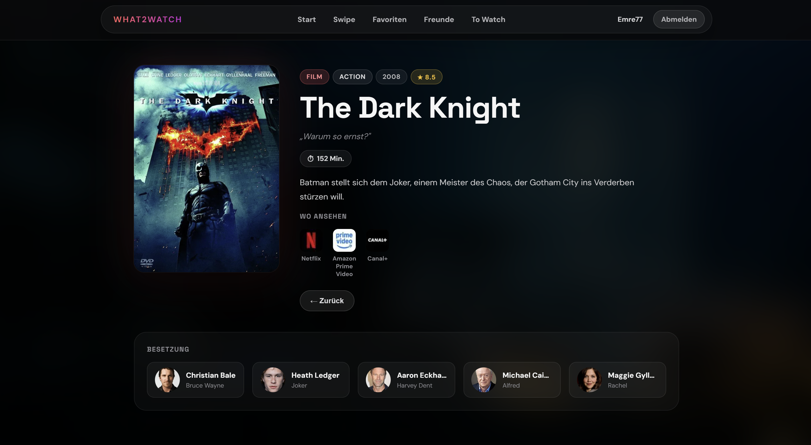
  *(Detailseite: Backdrop-Bild als Hintergrund, Poster mit Glow-Shadow, Titel, Genre, Beschreibung)*

  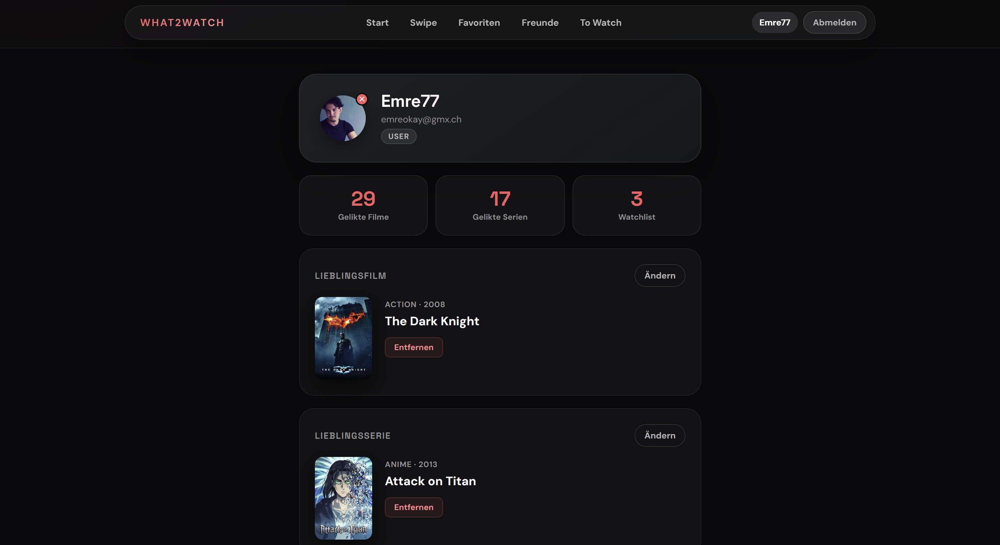
  *(Profilseite: Avatar-Upload, Username, E-Mail, Statistiken Favoriten/Watchlist/Watched)*

  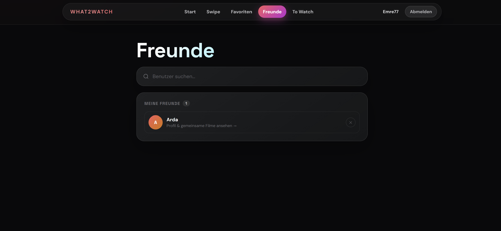
  *(Freundesseite: Nutzersuche, Status-Chips Befreundet/Ausstehend/Anfrage, Freundesliste)*

- **Designentscheidungen:**

  | Entscheidung | Umsetzung | Begründung |
  |---|---|---|
  | Dark Theme | `#09090b` als Basis | Cinematisches Feeling, augenschonend |
  | Farbakzente | Crimson-Rot `#ff5a5f` + Violett `#8b5cf6` | Warm, energetisch, modern |
  | Animierter Hintergrund | 5 Gradient-Orbs + Film-Grain SVG | Lebendige Atmosphäre ohne Video |
  | Glassmorphism | `backdrop-filter: blur()` auf Karten | Moderne Tiefenwirkung |
  | Gradient-Text | `-webkit-background-clip: text` auf Headings | Hochwertiges Erscheinungsbild |
  | Bottom Navigation | 5 Tabs + `env(safe-area-inset-bottom)` | Native App-Feel auf Smartphones |
  | Swipe-Karten-Stack | CSS 3D-Transforms, gestapelte Karten | Physikalisch anmutendes Swipen |

#### 3.4.2 Umsetzung (Technik)

- **Technologie-Stack:**

  | Technologie | Version | Zweck |
  |---|---|---|
  | SvelteKit | 2.57.0 | Web-Framework (SSR + Client-Side) |
  | Svelte | 5 (Runes) | Reaktive UI-Komponenten |
  | MongoDB Atlas | Cloud | Persistente Datenspeicherung |
  | TMDB API | v3 | Filmposter-Daten |
  | Netlify | – | Deployment (Edge-Adapter) |

- **Tooling:** Visual Studio Code, Git & GitHub, Claude Code CLI (KI-Assistent – siehe Kap. 6)

- **Struktur & Komponenten:**

  ```
  src/
  ├── routes/
  │   ├── +layout.svelte       # App-Layout, Top-Nav + Bottom-Nav
  │   ├── +page.svelte         # Startseite
  │   ├── swipe/               # Swipe-Modus (Touch + Mouse)
  │   ├── favorites/           # Favoriten-Liste mit Filter
  │   ├── watchlist/           # Watchlist + Watched
  │   ├── movie/[id]/          # Film-Detailansicht
  │   ├── add/                 # Film hinzufügen
  │   ├── profile/             # Benutzerprofil + Avatar-Upload
  │   ├── friends/             # Freunde-System
  │   ├── login/ & register/   # Authentifizierung
  │   └── api/                 # REST-Endpunkte (likes, watchlist, user-data, …)
  ├── lib/
  │   ├── stores.js            # Svelte Stores (favorites, watchlist, watched)
  │   └── server/db.js         # MongoDB-Verbindung
  scripts/
  └── expand-catalog.js        # DB-Befüllungs- und Poster-Fix-Skript
  ```

  **State Management:** `persisted()` Stores (localStorage) für sofortige UI-Reaktivität; MongoDB als persistente Backend-Quelle. Beim Login werden Favoriten, Watchlist und Watched aus der DB geladen und in die lokalen Stores synchronisiert.

- **Daten & Schnittstellen:**

  | MongoDB-Collection | Inhalt |
  |---|---|
  | `users` | Username, E-Mail, Passwort-Hash, Avatar, `likedMovies`, `watchlist`, `watched` |
  | `movies` | ~140 Einträge (Filme, Serien, Anime): Titel, Jahr, Genre, Beschreibung, Poster-URL, Typ |
  | `sessions` | Aktive Benutzersessions (Session-ID → User-ID) |
  | `friendships` | `{ fromId, toId, status: 'pending'/'accepted', createdAt }` |

  **TMDB API:** Poster werden via `/search/movie` und `/search/tv` bezogen. `scripts/expand-catalog.js` befüllt und aktualisiert die Datenbank automatisch.

- **Deployment:** [DEPLOYMENT URL – z.B. https://what2watch.netlify.app]

- **Besondere Entscheidungen:**
  - **Svelte 5 Runes** (`$state`, `$derived`, `$props`) – moderner, performanter als Options API
  - **Kein JWT:** Sessions serverseitig in MongoDB; Cookie enthält nur Session-ID
  - **Doppelstrategie** (`persisted()` + MongoDB): localStorage für sofortige Reaktivität, MongoDB für Langzeit-Persistenz
  - **Pointer Events API** (`setPointerCapture`) für Touch-Swipe – funktioniert auf Touch- und Maus-Geräten

---

### 3.5 Validate

- **URL der getesteten Version:** [Netlify Deployment URL – Stand 20.05.2026]
- **Datum:** 20.05.2026
- **Ziele der Prüfung:**
  - Versteht die Testperson auf der Startseite, was die App macht?
  - Ist die Navigation logisch und selbsterklärend?
  - Funktionieren zentrale Abläufe (Swipen, Favoriten, Watchlist, Film hinzufügen) ohne Erklärung?
  - Ist der Unterschied zwischen Favoriten, Watchlist und Watched klar?
  - Werden Rückmeldungen der App wahrgenommen?

- **Vorgehen:** Moderierter Test mit Think-Aloud-Protokoll, on-site am Laptop/PC im Browser. Der Testleiter beobachtete ohne einzugreifen und notierte Zögermomente, Missverständnisse und erfolgreiche Abläufe.

- **Stichprobe:** 2 Testpersonen
  - **Arthik Muralitharan:** Kommilitone, 20–25 Jahre, technikaffin; hatte bereits Skizzen-Feedback gegeben
  - **Maruthan:** Kollege, ähnliches Profil

- **Aufgaben/Szenarien:**

  > *«Du möchtest am Wochenende einen Filmabend machen, weisst aber noch nicht, was du schauen willst. Nutze What2Watch, um Filme zu entdecken und deine Watchlist zu organisieren.»*

  1. Startseite ansehen – wofür ist die App gedacht?
  2. In den Swipe-Modus wechseln und einen Film als Favorit speichern
  3. Favoriten-Liste öffnen und den Film auf die Watchlist legen
  4. Watchlist öffnen und einen Film als gesehen markieren
  5. Detailansicht eines Films aufrufen
  6. Eigenen Film hinzufügen (Titel, Jahr, Genre, Beschreibung)
  7. Zurück in den Swipe-Modus – erscheint der neue Film?

- **Kennzahlen & Beobachtungen:**

  | Aufgabe | Arthik | Maruthan | Anmerkung |
  |---|---|---|---|
  | 1 – Zweck der App verstehen | ✓ | ✓ | Sofort klar |
  | 2 – Film swipen und speichern | ✓ | ✓ | Swipe-Prinzip intuitiv |
  | 3 – Auf Watchlist legen | ⚠️ | ⚠️ | «To Watch»-Button nicht sofort gefunden |
  | 4 – Als gesehen markieren | ⚠️ | ✓ | «Watched»-Bezeichnung für Arthik unklar |
  | 5 – Detailansicht aufrufen | ✓ | ✓ | Poster-Klick intuitiv |
  | 6 – Film hinzufügen | ✓ | ✓ | Formular klar verständlich |
  | 7 – Neuer Film im Swipe | ✓ | ✓ | Funktioniert korrekt |

  **Qualitative Findings:**

  *Arthik Muralitharan:*
  - «Swipe Layout zu gross» – Karte nimmt zu viel Bildschirmfläche ein
  - «Watchlist: Watched ist verwirrend, nicht selbsterklärend zum Klicken»
  - «Von Favourites zu Watchlist ist nicht klar vom Vorgehen»
  - Positiv: «Cooles Layout und Prozess macht Sinn»

  *Maruthan:*
  - «Info, dass die Filme jetzt in To-Watch Liste drinnen sind» – fehlende Bestätigung nach dem Hinzufügen zur Watchlist

- **Zusammenfassung der Resultate:** Die Kernfunktion (Swipen, Favoriten speichern, Detailansicht, Film hinzufügen) wurde von beiden Testpersonen ohne Hilfe erfolgreich durchgeführt. Schwächen zeigten sich bei der Terminologie («Watched» nicht selbsterklärend) und fehlendem Aktions-Feedback. Das Gesamtlayout und der Prozessablauf wurden positiv bewertet.

- **Abgeleitete Verbesserungen:**

  | # | Problem (aus Evaluation) | Verbesserung | Priorität | Umgesetzt |
  |---|---|---|---|---|
  | 1 | «Watched»-Button nicht selbsterklärend | Button-Label → «Gesehen ✔» + Toast | Hoch | ✓ Kap. 4.4 |
  | 2 | Kein Feedback nach «Zur Watchlist hinzufügen» | Toast-Notification mit Bestätigung | Hoch | ✓ Kap. 4.4 |
  | 3 | Übergang Favoriten → Watchlist unklar | «To Watch →» mit klarer Beschriftung | Mittel | ✓ |
  | 4 | Swipe-Karte zu gross / unsauber | Layout angepasst, kompakteres Design | Mittel | ✓ |
  | 5 | Gesehene Filme weiter im Swipe sichtbar | Gesehene Filme aus Swipe-Deck ausschliessen | Niedrig | Geplant |

---

## 4. Erweiterungen

### 4.1 Benutzerauthentifizierung & sitzungsübergreifende Datenpersistenz

- **Beschreibung & Nutzen:** Nutzer können sich registrieren und einloggen. Alle persönlichen Daten (Favoriten, Watchlist, Watched) werden in MongoDB gespeichert und sind nach dem Aus- und Wieder-Einloggen vollständig wiederhergestellt. Das Figma-Mockup hatte diese Logik explizit als Schwachstelle bezeichnet («Buttons nur simuliert, keine echte Logik im Hintergrund»).
- **Wo umgesetzt:**
  - **Frontend:** `src/routes/login/`, `src/routes/register/`, `src/lib/stores.js` (Sync beim Login)
  - **Backend:** `src/routes/api/user-data/+server.js`, Session-Middleware in `src/hooks.server.js`
  - **Datenbank:** `users`-Collection mit `likedMovies`, `watchlist`, `watched`; `sessions`-Collection
- **Referenz:** Kap. 3.4.2 (Daten & Schnittstellen), Screenshot Profil (Kap. 3.4.1)
- **Aus Evaluation abgeleitet?:** Nein – war von Beginn an als Kernziel geplant

---

### 4.2 Freunde-System & gemeinsame Favoriten

- **Beschreibung & Nutzen:** Nutzer können andere Nutzer suchen (debounced Search), Freundschaftsanfragen senden/empfangen/ablehnen und Freundesprofile einsehen. Highlight: Die **Schnittmenge gemeinsamer Favoriten** wird angezeigt – ideal für gemeinsame Filmabend-Planung. Profilinformationen sind nur bei bestehender Freundschaft sichtbar.
- **Wo umgesetzt:**
  - **Frontend:** `src/routes/friends/+page.svelte`, `src/routes/friends/[userId]/+page.svelte`
  - **Backend:** `src/routes/api/users/search/+server.js`, `src/routes/friends/+page.server.js`, `src/routes/friends/[userId]/+page.server.js`
  - **Datenbank:** `friendships`-Collection (`fromId`, `toId`, `status: 'pending'|'accepted'`)
- **Referenz:** Screenshot Freunde (Kap. 3.4.1)
- **Aus Evaluation abgeleitet?:** Nein – eigenständige Erweiterung für sozialen Mehrwert

---

### 4.3 Erweiterte Filterung in der Favoriten-Liste

- **Beschreibung & Nutzen:** Die Favoriten-Liste kann nach Inhaltstyp (Alle / Filme / Serien) und nach Genre gefiltert werden. Genre-Chips werden dynamisch aus den vorhandenen Favoriten generiert. Erleichtert die Navigation in grossen Favoritenlisten erheblich.
- **Wo umgesetzt:**
  - **Frontend:** `src/routes/favorites/+page.svelte` (Filter-Tabs, Genre-Chips, `$derived`-Reaktivität)
- **Referenz:** Screenshot Favoriten (Kap. 3.4.1)
- **Aus Evaluation abgeleitet?:** Nein – eigenständige UX-Verbesserung

---

### 4.4 Toast-Benachrichtigungen & verbessertes Aktions-Feedback

- **Beschreibung & Nutzen:** Nach relevanten Aktionen (Film zur Watchlist hinzufügen, Film als gesehen markieren) erscheint eine Toast-Benachrichtigung. Auf Mobile erscheint die Toast oberhalb der Bottom-Navigation. Adressiert direkt die Evaluation-Findings von Maruthan (Issue #2) und Arthik (Issue #1).
- **Wo umgesetzt:**
  - **Frontend:** `src/routes/favorites/+page.svelte` (Toast-State + Svelte-Transition), `src/routes/watchlist/+page.svelte`
- **Referenz:** Abgeleitete Verbesserungen Kap. 3.5
- **Aus Evaluation abgeleitet?:** **Ja** – direkt aus Issues #1 und #2 der Evaluation

---

### 4.5 TMDB API-Integration & erweiterter Filmkatalog

- **Beschreibung & Nutzen:** Filmposter werden automatisch über die TMDB API v3 bezogen. Das Skript `scripts/expand-catalog.js` erweiterte die Datenbank von ~10 auf ~140 Einträge (Filme, Serien, Anime) und korrigiert fehlende Poster automatisch. Duplikate werden via Titel+Jahr-Prüfung verhindert. Das Figma-Mockup hatte nur 3 Beispieltitel; die finale App ermöglicht einen realistischen Swipe-Betrieb.
- **Wo umgesetzt:**
  - **Skript:** `scripts/expand-catalog.js` (4-stufig: Type-Fix → Poster-Fix → neue Filme → neue Serien/Anime)
  - **Datenbank:** `movies`-Collection (~140 Dokumente mit echten TMDB-Posterlinks)
- **Referenz:** Kap. 3.4.2 (Daten & Schnittstellen)
- **Aus Evaluation abgeleitet?:** Nein – eigenständige Verbesserung für realistischen Betrieb

---

### 4.6 Vollständig mobil-responsives Design mit Touch-Support

- **Beschreibung & Nutzen:** Die App ist Mobile-First optimiert: Bottom-Navigation (5 Tabs), Touch-Swipe über Pointer Events API (`setPointerCapture`), `100dvh` und `env(safe-area-inset-bottom)` für korrekte Darstellung auf Smartphones, dedizierte `@media (max-width: 680px)`-Breakpoints auf allen Seiten. Das Figma-Mockup hatte die Plattformstrategie noch als offen bezeichnet.
- **Wo umgesetzt:**
  - **Frontend:** `src/routes/+layout.svelte` (Bottom Nav), `src/routes/swipe/+page.svelte` (Touch-Events), alle Seiten (responsive CSS)
- **Referenz:** Kap. 3.4.1 (Designentscheidungen)
- **Aus Evaluation abgeleitet?:** Nein – von Beginn an als Anforderung definiert

---

### 4.7 Atmosphärisches Hintergrund-Design (Ambient UI)

- **Beschreibung & Nutzen:** Die Startseite verfügt über ein lebendiges Hintergrund-System: 5 driftende Gradient-Orbs (Crimson, Violett, Magenta, Cyan, Rose) mit kombinierten Drift- und Puls-Animationen (Scale 0.88–1.15), Film-Grain-Overlay via SVG `<feTurbulence>`-Filter und periodischer Shimmer-Sweep auf der Hero-Card. Vermittelt cinematische Atmosphäre und unterscheidet die App visuell von Standard-Streaming-Interfaces.
- **Wo umgesetzt:**
  - **Frontend:** `src/routes/+page.svelte` (5 Orbs, Film-Grain SVG, Hero-Card `::after`), `src/routes/+layout.svelte` (globale Ambient Glows)
- **Referenz:** Screenshot Startseite (Kap. 3.4.1)
- **Aus Evaluation abgeleitet?:** Nein – eigenständige Design-Erweiterung

---

### 4.8 KI-Agenten-Workflow mit Claude Code (VS Code)

- **Beschreibung & Nutzen:** Die Implementierung erfolgte mit dem **Claude Code CLI** (Anthropic) direkt in VS Code. Dabei wurde ein strukturierter Agenten-Workflow genutzt: Ein persistentes Memory-System (`.claude/projects/`) bewahrt Projektkontext über Sessions hinweg. Der Agent wurde für klar abgegrenzte Subtasks eingesetzt (API-Endpunkte, CSS-Animationen, Datenbanklogik). Dieser Workflow entspricht dem in der Aufgabenstellung genannten Erweiterungsbeispiel «Anpassung eines KI-Agenten-Workflows in VS Code».
- **Wo umgesetzt:** Entwicklungsprozess; `.claude/`-Konfiguration im Repository
- **Referenz:** Kap. 6 (KI-Deklaration)
- **Aus Evaluation abgeleitet?:** Nein – methodische Prozess-Erweiterung

---

## 5. Projektorganisation

- **Repository & Struktur:** [https://github.com/EmreOkay33/What2Watch](https://github.com/EmreOkay33/What2Watch)

  ```
  /
  ├── src/        # SvelteKit Quellcode
  ├── scripts/    # Datenbankbefüllungs-Skripte
  ├── static/     # Statische Assets
  ├── docs/       # Dokumentations-Assets (Screenshots, Skizzen, Diagramme)
  └── README.md   # Diese Projektdokumentation
  ```

- **Commit-Praxis:** Sprechende Commit-Messages im Verb-Substantiv-Stil (Beispiele: `Add Netlify adapter for proper deployment`, `Install MongoDB dependency for API routes`, `Update app UI and remove redundant navigation buttons`).

- **Issue-Management:** Entwicklung iterativ entlang der Phasen; Verbesserungen aus der Evaluation wurden direkt priorisiert und umgesetzt (vgl. Kap. 3.5).

- **Zugang für Dozierende:** Repository zugänglich für `mmeisterhans` und `bkuehnis`.

---

## 6. KI-Deklaration

### 6.1 KI-Tools

- **Eingesetzte Tools:** Claude Code CLI (Anthropic), Modell `claude-sonnet-4-6`, eingesetzt direkt in Visual Studio Code
- **Zweck & Umfang:** Claude Code wurde für die **gesamte technische Implementierung** verwendet:
  - Sämtlicher Frontend-Code (Svelte 5-Komponenten, CSS-Animationen, responsive Layouts)
  - Alle Backend API-Endpunkte (SvelteKit Server Routes, Form Actions)
  - Datenbankabfragen und -operationen (MongoDB CRUD)
  - Touch-Event-Handling (Pointer Events API)
  - Das Datenbankbefüllungs-Skript (`scripts/expand-catalog.js`)
  - Debugging, Fehlerbehebung und Refactoring
- **Eigene Leistung (Abgrenzung):**
  - **Projektidee und Konzept:** Vollständig eigenständig
  - **Phasen Understand, Sketch, Decide:** Problemanalyse, Proto-Persona, Handskizzen, Figma-Mockup, Activity-Diagramm, Peer-Feedback – ohne KI
  - **Evaluation:** Planung, Durchführung und Auswertung vollständig eigenständig
  - **Anforderungsdefinition und Feature-Priorisierung:** Eigenständig
  - **Qualitätskontrolle:** Jede Änderung im Browser geprüft und bewertet; Fehler eigenständig diagnostiziert

### 6.2 Prompt-Vorgehen

Die Zusammenarbeit mit Claude Code folgte einem iterativen, konversationellen Ansatz über mehrere Sessions:

1. **Anforderung beschreiben:** Gewünschte Funktion in natürlicher Sprache mit klarem Ziel und Kontext
2. **Kontext bereitstellen:** Relevante Dateipfade, bestehende Datenbankstrukturen und Abhängigkeiten explizit nennen
3. **Iterativ verfeinern:** Fehler und Abweichungen beschreiben; Claude korrigiert in Folge-Prompts
4. **Design-Iterationen:** Visuelle Anpassungen durch konkrete Beschreibungen steuern

Das persistente Memory-System bewahrte Projektkontext über mehrere Sessions, sodass Hintergrundwissen nicht jedes Mal neu erklärt werden musste.

*Beispiel-Prompt:* «Füge zur Favoriten-Liste eine Toast-Benachrichtigung hinzu. Sie soll erscheinen, wenn ein Film zur Watchlist hinzugefügt wird. Auf Mobile soll die Toast über der Bottom-Navigation erscheinen (`calc(72px + env(safe-area-inset-bottom) + 0.75rem)`).»

### 6.3 Reflexion

**Nutzen:**
- Drastische Reduktion der Implementierungszeit: Komplexe Features (Freunde-System, Touch-Swipe, MongoDB-Sync) konnten in Stunden statt Tagen realisiert werden
- Hohe Code-Qualität: Svelte 5 Runes, moderne CSS-Techniken, robuste API-Strukturen
- Exploration von Technologien (Pointer Events API, SVG `feTurbulence`), die ohne KI-Unterstützung in der verfügbaren Zeit nicht erlernbar gewesen wären

**Grenzen:**
- Kein direkter visueller Zugriff auf die laufende App – Rendering-Probleme mussten beschreibend kommuniziert werden
- Bei komplexen Refactorings (z.B. Watched-Persistenz über Sessions) waren mehrere Korrektur-Iterationen nötig
- Ohne eigenes Verständnis der SvelteKit-Architektur wäre eine sinnvolle Steuerung nicht möglich gewesen

**Qualitätssicherung:**
- Jede Änderung wurde manuell im Browser getestet (Golden Path + Edge Cases)
- Fehlermeldungen aus dem Dev-Server wurden direkt analysiert und als Feedback eingebracht
- Finale Implementierungsentscheidungen lagen stets beim Autor

---

## 7. Anhang

**Quellen:**
- TMDB API v3: [https://developer.themoviedb.org/docs](https://developer.themoviedb.org/docs) – Filmposter; Lizenz: TMDB Terms of Use
- SvelteKit Dokumentation: [https://kit.svelte.dev/docs](https://kit.svelte.dev/docs)
- Svelte 5 Runes: [https://svelte.dev/docs/svelte/v5-migration-guide](https://svelte.dev/docs/svelte/v5-migration-guide)
- MongoDB Node.js Driver: [https://www.mongodb.com/docs/drivers/node/current/](https://www.mongodb.com/docs/drivers/node/current/)

**Testskript & Materialien:**
- Testplan (20.05.2026): Ziele, Szenario, 7 Aufgaben, Beobachtungskriterien, Nachfrage-Fragen
- Rohdaten: Qualitatives Feedback Arthik Muralitharan + Maruthan (20.05.2026)
- Skizzen-Feedback: Arthik Muralitharan (15.04.2026)

---

> **Noch zu erledigen vor der Abgabe – Screenshots in `docs/` einfügen:**
>
> | Pfad | Inhalt |
> |---|---|
> | `docs/sketch.jpg` | Foto der Handskizze (Seite 1 des Skizzen-Dokuments) |
> | `docs/activity-diagram.png` | Screenshot des Activity Diagramms |
> | `docs/figma/swipe-screen.png` | Figma-Mockup: Swipe-Screen |
> | `docs/figma/favorites.png` | Figma-Mockup: Favoriten-Liste |
> | `docs/figma/watchlist.png` | Figma-Mockup: Watchlist |
> | `docs/screenshots/home.png` | App: Startseite |
> | `docs/screenshots/swipe.png` | App: Swipe-Modus |
> | `docs/screenshots/favorites.png` | App: Favoriten-Liste |
> | `docs/screenshots/watchlist.png` | App: Watchlist |
> | `docs/screenshots/detail.png` | App: Detailansicht |
> | `docs/screenshots/profile.png` | App: Profilseite |
> | `docs/screenshots/friends.png` | App: Freundesseite |
> | – | GitHub-URL und Deployment-URL in Kap. 3.4.2 / 5 eintragen |
> | – | Figma-URL in Kap. 3.3 eintragen |
